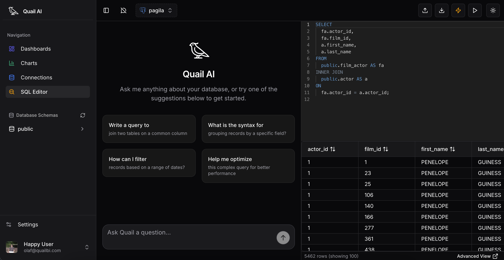
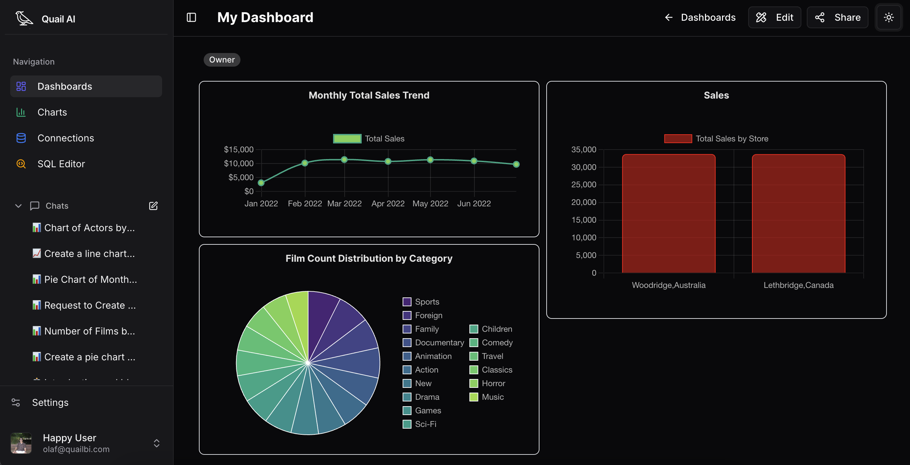

<p align="center">
  
</p>

# Quail

Quail is an AI-powered data analysis and visualization platform built with Next.js and TypeScript. It enables users to query SQL databases, generate charts, and gain business insights using conversational AI.

## Screenshots

<p align="center">
  
  <br/>
  <em>AI-Assisted SQL Editor - Ask questions in natural language and generate SQL queries</em>
</p>

<p align="center">
  
  <br/>
  <em>Interactive Dashboard - Visualize your data with dynamic charts and insights</em>
</p>

## Key Features

- **AI-Assisted SQL Querying**: Ask questions in natural language and let the AI generate SQL queries and explanations.
- **Data Visualization**: Create and view interactive dashboards and charts from your database results.
- **Agentic Hydration Pattern**: Efficiently generates UI components by separating scaffold generation and data hydration, improving performance and reliability in LLM-based applications.
- **Secure Data Handling**: Only read-only queries are executed; database credentials are encrypted and stored locally. 

## Getting Started

### Prerequisites

- Node.js >= 18.17.0
- pnpm 10.10.0
- MongoDB instance
- Supabase account (for authentication)

### Environment Setup

1. Clone the repository:
   ```bash
   git clone https://github.com/O1af/quail.git
   cd quail
   ```

2. Copy the example environment file:
   ```bash
   cp .env.example .env.local
   ```

3. Configure your environment variables in `.env.local`:
   
   **Required Variables:**
   - `NEXT_PUBLIC_ENCRYPTION_KEY`: A 32-character encryption key for securing user data
     - Generate using: `openssl rand -base64 32`
   - `NEXT_PUBLIC_SUPABASE_URL`: Your Supabase project URL
   - `NEXT_PUBLIC_SUPABASE_ANON_KEY`: Your Supabase anonymous key
   - `SUPABASE_SERVICE_ROLE_KEY`: Your Supabase service role key
   - `MONGODB_URI`: Your MongoDB connection string
   
   **Optional Variables:**
   - `NEXT_PUBLIC_DEFAULT_DB_CONNECTION_STRING`: Default demo database connection string
   - Azure AI, Stripe keys (if using those features)

4. Install dependencies:
   ```bash
   pnpm install
   ```

5. Run the development server:
   ```bash
   pnpm dev
   ```

6. Open [http://localhost:3000](http://localhost:3000) in your browser.

### Building for Production

```bash
pnpm build
pnpm start
```

## Security Notes

- Never commit `.env.local` or any file containing secrets to version control
- The `.env.example` file is safe to commit and should be kept up-to-date with required variables
- All database connection strings are encrypted before storage
- The `NEXT_PUBLIC_ENCRYPTION_KEY` must be set or the application will throw an error

